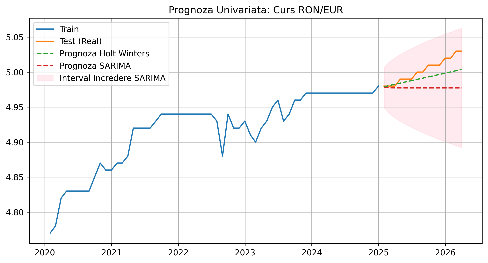
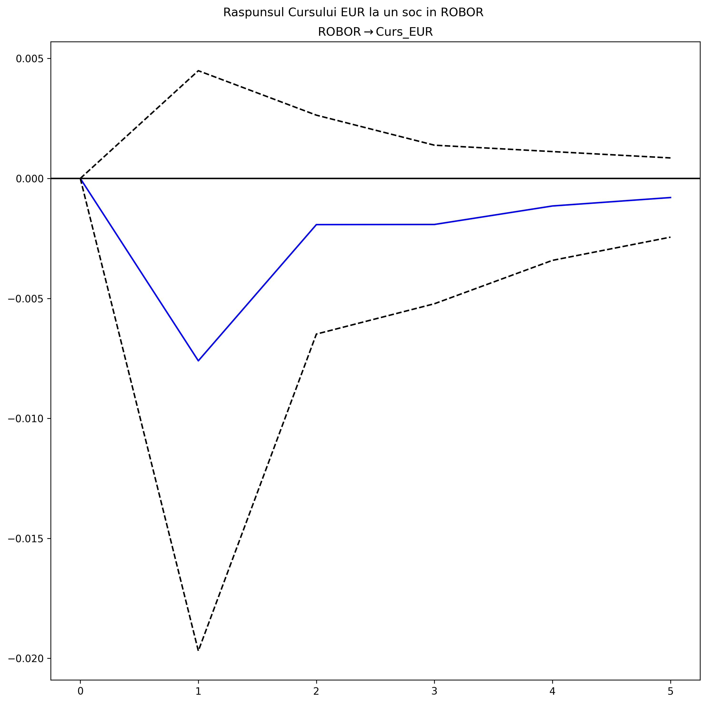
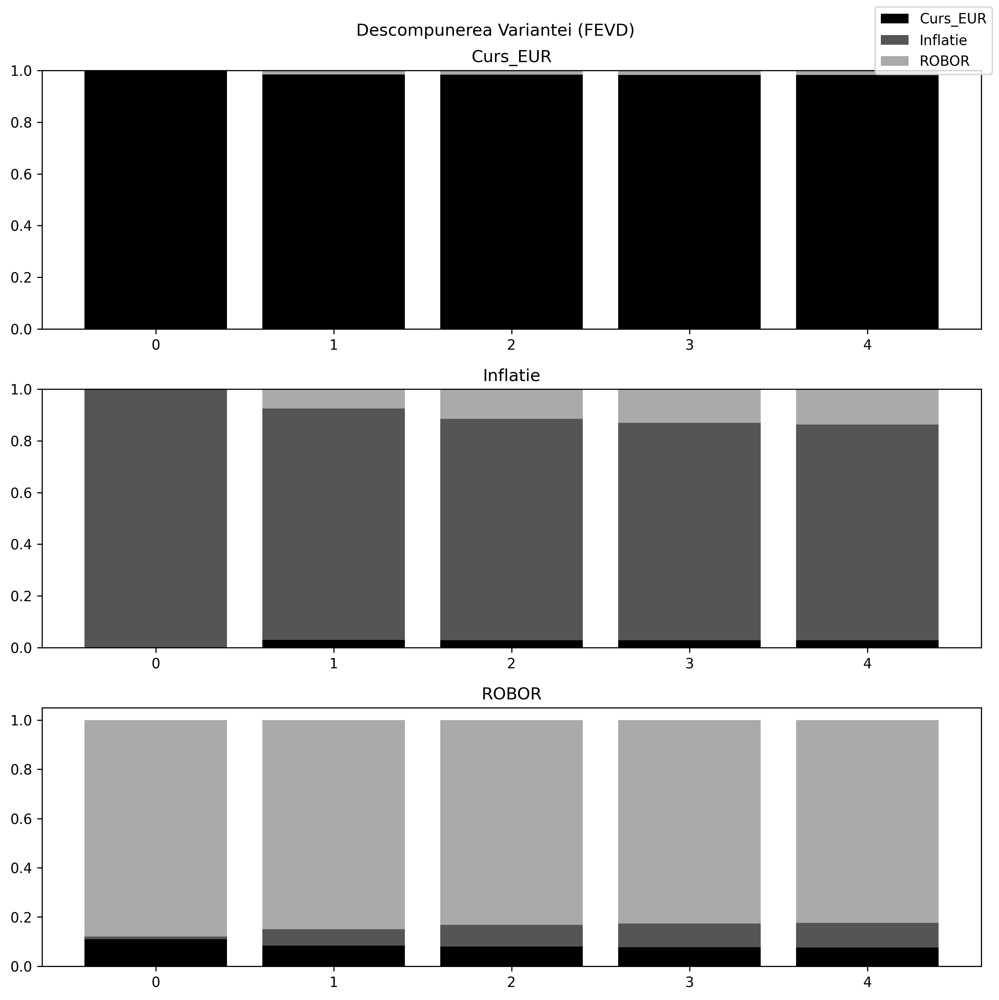

# Time Series Analysis: RON/EUR Exchange Rate

A Python-based project for analyzing and forecasting macroeconomic indicators (Exchange Rate, Inflation, ROBOR) using univariate and multivariate time series models.

---

## 📊 Visual Analysis

### 1. Univariate Forecasting
Comparison of **Holt-Winters** and **SARIMA** models. This section evaluates which model better captures the trend and seasonality of the RON/EUR exchange rate.

### 2. Impulse Response (IRF)
Shows the dynamic response of the **Exchange Rate** to a simulated "shock" in **ROBOR** interest rates, calculated via Vector Autoregression (VAR).

### 3. Variance Decomposition (FEVD)
Illustrates how much of the variation in one variable is explained by itself versus other variables in the system over time.

---
